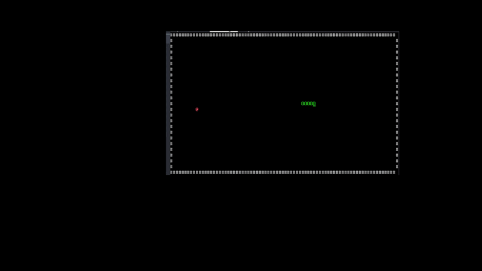

# 🐍 Snake Game in x86 Assembly (8086)

A fully functional Snake Game built entirely in **8086 Assembly Language**, using BIOS and DOS interrupts for display, input handling, and game logic — no high-level libraries, no frameworks, just raw low-level code.



---

## 🔧 Technical Highlights

- **Language:** x86 Assembly (8086)
- **Assembler:** TASM / MASM
- **Platform:** DOS / DOSBox
- **Display:** BIOS INT 10h — text mode 80×25, color-coded characters
- **Input:** BIOS INT 16h — non-blocking keyboard polling
- **Randomization:** System clock via INT 1Ah for food placement
- **Memory:** Manual array management for snake body coordinates (no dynamic allocation)
- **Game Loop:** Delay-controlled loop with real-time input, movement, collision, and rendering

---

## 🎮 Gameplay

- Control the snake using **Arrow Keys** or **W / A / S / D**
- Eat food `@` (red) to grow the snake and increase your score
- Game ends when the snake hits a wall
- Score is displayed on the Game Over screen

---

## 📁 Project Structure

```
Snake-Game/
├── SnakeGame.ASM       # Main source file (8086 Assembly)
├── game.gif  # Gameplay demo
├── README.md
└── .gitignore
```

---

## ⚙️ How to Run

### Requirements
- [DOSBox](https://www.dosbox.com/) — DOS emulator for modern systems
- TASM (Turbo Assembler) **or** MASM (Microsoft Assembler)

### Steps

**1. Mount your project folder in DOSBox:**
```
mount c c:\path\to\Snake-Game
c:
```

**2. Assemble the source file:**
```
tasm snake.asm       ← using TASM
masm snake.asm;      ← using MASM
```

**3. Link the object file:**
```
link snake.obj
```

**4. Run the game:**
```
snake.exe
```

> Make sure DOSBox is set to **80×25 text mode** for correct rendering.

---

## 💡 What This Project Demonstrates

| Concept | Implementation |
|---|---|
| Low-level I/O | BIOS/DOS interrupt calls (INT 10h, 16h, 1Ah, 21h) |
| Memory management | Manual byte arrays for snake X/Y coordinates |
| Game loop design | Polling-based input + delay routine for speed control |
| Collision detection | Boundary and food checks via register comparisons |
| Randomization | Clock tick entropy (CX:DX from INT 1Ah) with modulo |
| Screen rendering | Cursor positioning + character/attribute writes via INT 10h |

---

## 🛠️ Built With


---

## 👩‍💻 Author

**Nayab Naeem**  
[GitHub](https://github.com/Nayab-Naeem) • [Portfolio](https://nayabnaeem.netlify.app)
